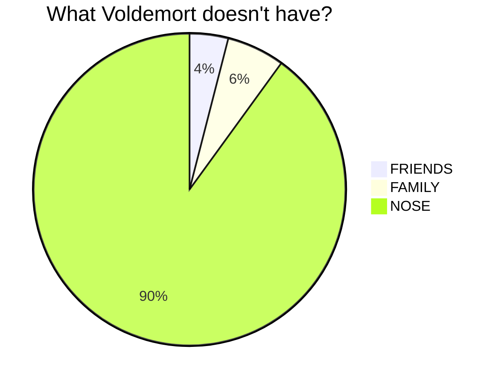

# Lab 9 - Mermaid graphs and charts

A feature that is often missed: Obisian contains Mermaid support, which means you can make graphs directly in Obsidian. Find out the capabilities of Mermaid here: [https://mermaid.js.org/intro/](https://mermaid.js.org/intro/).

You'll find that typing a graph is liberating!

### Examples

<pre><code>
``` mermaid
graph TD
    A[Christmas] -->|Get money| B(Go shopping)
    B --> C{Let me think}
    C -->|One| D[Laptop]
    C -->|Two| E[iPhone]
    C -->|Three| F[fa:fa-car Car]
```</pre></code>

Makes:

```mermaid
graph TD
    A[Christmas] -->|Get money| B(Go shopping)
    B --> C{Let me think}
    C -->|One| D[Laptop]
    C -->|Two| E[iPhone]
    C -->|Three| F[fa:fa-car Car]
```

<pre><code>``` mermaid
pie title What Voldemort doesn't have?
         "FRIENDS" : 2
         "FAMILY" : 3
         "NOSE" : 45

```</code></pre>

Makes:


